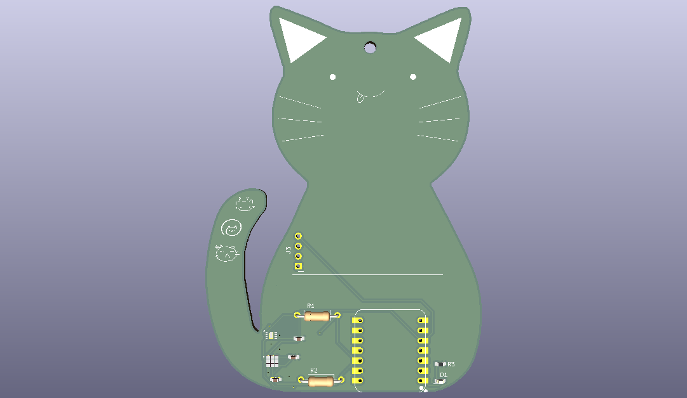

# aqkitty

The aqKitty is a kitty shaped PCB that detects air quality, humidity, and temperature, then displays current condition on an OLED screen. Also, its a kitty :3

I made this project to solidify my understanding in KiCad, and my general electronics understanding! I felt that after the blinky board, I wanted to learn much more and do more with KiCad, so I decided to follow the Hermes tutorial on Stasis (although no, I didn't submit to Stasis).

I made this project primarily using KiCad, and used EasyEDA for symbols & footprints of the temp and AQ sensors!

This time around, building this PCB was definitely a step up from the blinky board, because it required more understanding of power nets, decoupling capacitors, pullup resistors, net labels, and efficient PCB layout strategies. I struggled the first time building this because I thought I could just add a sensor and microcontroller and call it a day. I then learned lots of things about slightly more complicated PCBs, requiring more than one capacitor, resistor, and other things.

Overall I had lots of fun making this project and I think it turned out super cute! I will definitely consider building it once I get a heat gun for the sensors >:)
